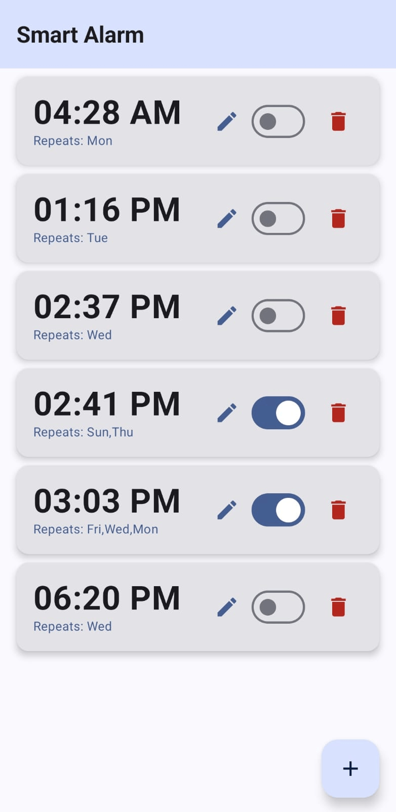
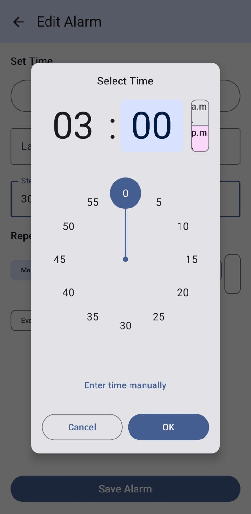
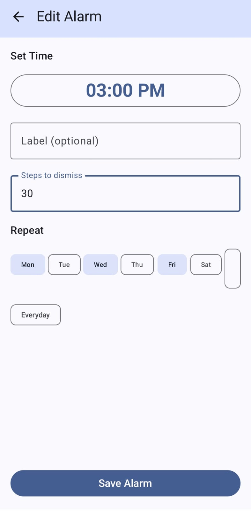
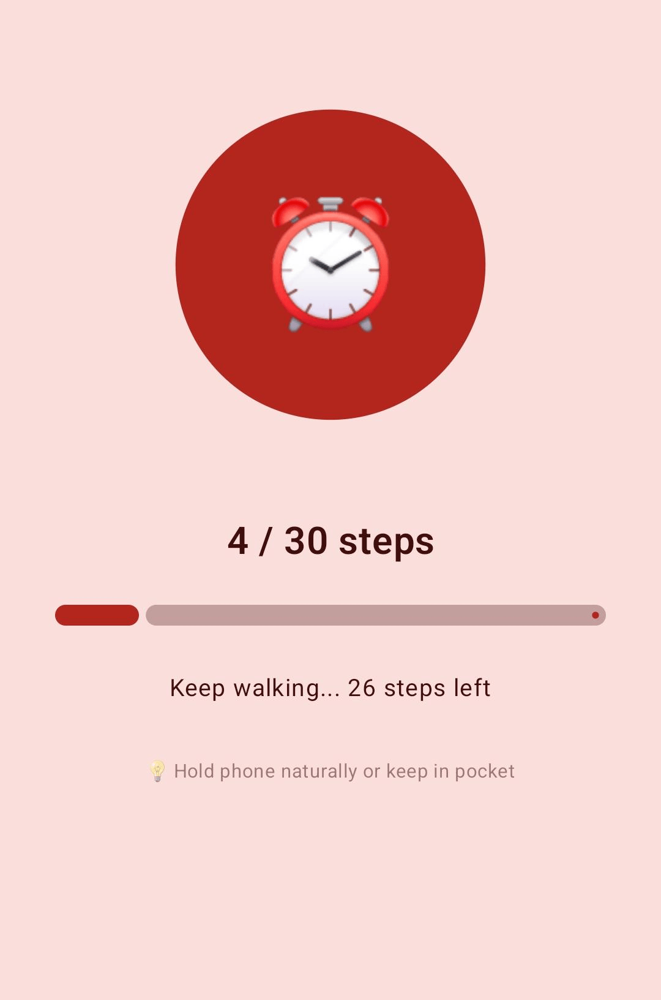

# ⏰ Smart Alarm App

An Android alarm app that **forces you to wake up** by requiring you to walk a set number of steps before the alarm can be dismissed.

Built with Kotlin, Jetpack Compose, Room, and Android Sensor APIs.

---

## 📱 Features

- **Step-based dismissal** — set number of steps required to dismiss alarm
- **Anti-cheat system** — 3-layer validation using accelerometer, step interval timing and rhythm consistency to prevent faking steps
- **Repeat scheduling** — set alarms for specific days or one-time
- **Persists after reboot** — alarms are rescheduled automatically after phone restart
- **12-hour clock UI** — AM/PM time picker with manual input toggle
- **Edit alarms** — modify existing alarms with pre-filled form
- **Sound + Vibration** — plays default alarm ringtone with vibration pattern
- **Live step counter** — progress bar updates in real time as you walk

---

## 🛠️ Tech Stack

| Technology | Usage |
|------------|-------|
| Kotlin | Primary language |
| Jetpack Compose | UI framework |
| Room (SQLite) | Local database for alarm persistence |
| AlarmManager | Precise alarm scheduling |
| TYPE_STEP_DETECTOR | Hardware step detection sensor |
| TYPE_ACCELEROMETER | Motion validation for anti-cheat |
| BootReceiver | Reschedule alarms after reboot |
| MVVM Architecture | ViewModel + StateFlow + DAO |

---

## 🏗️ Project Structure

    com.example.smartalarmapp/
    ├── data/
    │   ├── Alarm.kt              # Room entity - alarm data model
    │   ├── AlarmDao.kt           # Database operations
    │   └── AlarmDatabase.kt      # Room database singleton
    ├── receiver/
    │   ├── AlarmReceiver.kt      # Fires when alarm time hits
    │   └── BootReceiver.kt       # Reschedules alarms after reboot
    ├── ui/
    │   ├── AlarmListScreen.kt    # Home screen - list of alarms
    │   ├── AddEditAlarmScreen.kt # Add/edit alarm form
    │   └── AlarmRingingActivity.kt # Fullscreen ringing screen
    ├── utils/
    │   ├── AlarmScheduler.kt     # AlarmManager scheduling logic
    │   └── StepDetector.kt       # Step detection + anti-cheat
    └── viewmodel/
        └── AlarmViewModel.kt     # Business logic + DB operations
---

## 🔒 Anti-Cheat System

The step detection uses a **3-layer validation** system:

1. **Accelerometer check** — rejects steps if force > 5G (tapping/shaking generates higher force than walking)
2. **Time interval check** — rejects steps if < 200ms apart (real walking = 400-800ms between steps)
3. **Rhythm consistency check** — rejects steps if interval deviation > 800ms (walking has consistent rhythm, tapping does not)

---

## 📸 Screenshots
| Alarm List                                | Time Picker                                 | Steps & Days                                    | Ringing Screen                                    |
|-------------------------------------------|---------------------------------------------|-------------------------------------------------|---------------------------------------------------|
|  |  |  |  |
---

## ⚙️ Setup

1. Clone the repo
```bash
git clone https://github.com/Akansha-08/Smart-Alarm-App.git
```

2. Open in **Android Studio**

3. Build and run on device (minSdk 26 / Android 8.0+)

4. Grant permissions when prompted:
    - **Exact Alarm** — for precise alarm scheduling
    - **Physical Activity** — for step detection
    - **Notifications** — for alarm notification

---

## 🔮 Future Improvements

- Eye detection verification using front camera
- Sleep analytics and smart wake-up recommendations
- AI-based optimal wake time suggestions
- Widget for home screen

---

## 👩‍💻 Author

**Akansha** 
B.Tech CSE 
